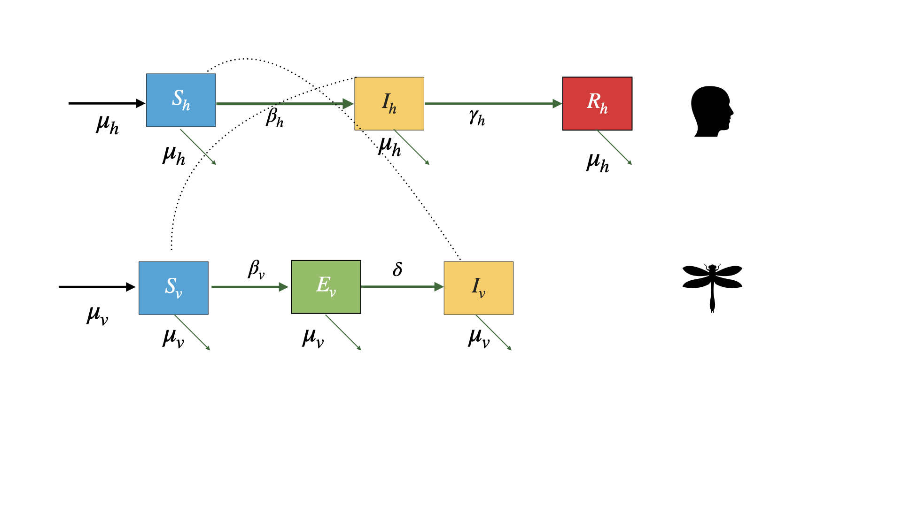

# Cargar las librerías requeridas

```{r}
library(deSolve)
library(ggplot2)
library(gridExtra)
```

# Modelo básico Zika
#### Variables del sistema

 - $S_h$ : Humanos suceptibles.
 - $I_h$ : Humanos infectados/infecciosos.
 - $R_h$ : Humanos recuperados  de la infección (recuperados por vida)
 - $S_v$ : Vectores suceptibles
 - $E_v$ : Vectores expuestos 
 - $I_v$ : Vectores infectados
 
# Diagrama de flujo (parte I)
 
## Ecuaciones
 
# Los parámetros del sistema 
 
 Los parámetros provienen del artículo [Countering the Zika epidemic in Latin America]( http://science.sciencemag.org/content/early/2016/07/13/science.aag0219 )
 
```{r}
Lv <- 10 # Esperanza de vida de los mosquitos (en días)
Lh <- 50 * 365 # Esperanza de vida de los humanos (en días)
Iph <- 7 # Periodo infeccioso en humanos (en días)
IP <- 6 # Periodo infeccioso en vectores (en días)
EIP <- 8.4 # Período de incubación extrínseco en mosquitos adultos
muv <- 1/Lv # Mortalidad en mosquitos
muh <- 1/Lh # Mortalidad en humanos
gamma <- 1/Iph # Tasa de recuperación en humanos
delta <- 1/EIP # Tasa de incubación extrínseca
# Tamaño de la población
Nh <- 2.4 * 10^6# Número de humanos (Población de Cali, Colombia)
m <- 2 # Proporción vector a humano
Nv <- m * Nh # Número de vectores
betah <- 0.7 # Probabilidad de transmisión del vector al hospedador
betav <- 0.7 # Probabilidad de transmisión del hospedador al vector
R0 <- 3 # Número reproductivo
b <- sqrt((R0 ^2 * muv*(muv+delta) * (muh+gamma)) /(m * betah * betav * delta)) # tasa de picadura
TIME <- 100 # Número de años a simular
```

# Ecuaciones del modelo

## Las ecuaciones para los humanos

$$\dot S_h =\mu_hN_h-\frac{\beta_h b}{N_h}S_hI_v-\mu_hS_h$$
 

$$\dot I_h=\frac{\beta_h b}{N_h}S_h I_v -(\gamma_h +\mu_h)I_h$$

$$\dot R_h=\gamma_hI_h-\mu_hR_h$$

## Ecuaciones de los vectores

$$\dot S_v=\mu_vN_v -\frac{\beta_vb}{N_h}I_hS_v-\mu_vS_v$$

$$\dot E_v= \frac{\beta_vb}{N_h}I_hS_v-(\delta +\mu_v)E_v$$
$$\dot I_v=\delta R_v-\mu_vI_v$$

# Número reprodcutivo básico $R_0$

$$R_0=\frac{mb^2\beta_h\beta_v\delta}{\mu_v(\mu_v +\delta)(\mu_h +\gamma_h)}$$
# Diagrama de flujo (parte II)

Ahora que conoce las ecuaciones, complete el diagrama de flujo con los parámetros y la conexión correcta entre los diferentes compartimentos.

# Modelo resuleto en R vía la librería `desolve`

Esta es la función que resuelve el sistema

```{r}
arbovmodel <- function(t, x, params) {
  
  Sh <- x[1]    # Humanos suceptibles
  Ih <- x[2]    # Humans infectados 
  Rh <- x[3]    # Humanos recuperados
  Sv <- x[4]    # Vectores suceptibles
  Ev <- x[5]    # Vectores expuestos
  Iv <- x[6]    # Vectores infectados
  
  
  
  with(as.list(params), # entorno local para evaluar derivados
       {
         # Humanos
         dSh   <-  muh * Nh - (betah * b/Nh) * Sh * Iv - muh * Sh   
         dIh   <-  (betah * b/Nh) * Sh * Iv  - (gamma + muh) * Ih
         dRh   <-  gamma   * Ih  - muh * Rh
         
         # Vectores
         dSv  <-  muv * Nv - (betav* b/Nh) * Ih * Sv - muv * Sv 
         dEv  <-  (betav * b/Nh) * Ih * Sv - (delta + muv)* Ev
         dIv  <-  delta * Ev - muv * Iv
         
         dx   <- c(dSh, dIh, dRh, dSv, dEv, dIv)
         list(dx)
       }
  )
}
```


```{r}
# Tiempo 
times  <- seq(1, 365 * TIME , by = 1)

# Especifique los parametros
params <- c(
  muv      = muv,     
  muh      = muh,     
  gamma    = gamma,   
  delta    = delta,   
  b        = b,       
  betah    = betah,   
  betav    = betav,   
  Nh       = Nh,      
  Nv       = Nv
  
)


# Condiciones iniciales del sistema
xstart <- c(Sh = Nh,        # COMPLETE 
            Ih = 1,        # COMPLETE
            Rh = 0,        # COMPLETE
            Sv = Nv,        # COMPLETE
            Ev = 0,        # COMPLETE
            Iv = 1)        # COMPLETE

# Resuelva las ecuaciones
out <- as.data.frame(ode(y=xstart,   # COMPLETE
                      times=times,   # COMPLETE
                      fun = arbovmodel,   # COMPLETE
                         parms  = params))  # COMPLETE
```


# Resultados

```{r}
# Cree las opciones de tiempo a mostrar 
out$years <- out[,1]/365
out$weeks <- out[,1]/7
```

# Comportamiento General (Población humana)

```{r}
# Revise el comportamiento general del modelo para 100 años

p1h <- ggplot(data = out, aes(y = (Rh + Ih + Sh)/10000, x = years)) +
  geom_line(color = 'grey68', size = 1) +
  ggtitle('Población humana total') +
  theme_bw() + ylab('number per 10,000')

p2h <- ggplot(data = out, aes(y = Sh/10000, x = years)) +
  geom_line(color = 'royalblue', size = 1) +
  ggtitle('Población humana susceptible') +
  theme_bw() + ylab('number per 10,000')

p3h <- ggplot(data = out, aes(y = Ih/10000, x = years)) +
  geom_line(color = 'firebrick', size = 1) +
  ggtitle('Población humana infectada') +
  theme_bw() + ylab('number per 10,000')

p4h <- ggplot(data = out, aes(y = Rh/10000, x = years)) +
  geom_line(color = 'olivedrab', size = 1) +
  ggtitle('Población humana recuperada') +
  theme_bw() + ylab('number per 10,000')


grid.arrange(p1h, p2h, p3h, p4h, ncol = 2)


```

# Comportamiento General (Población de vectores)

```{r}
# Revise el comportamiento general del modelo

p1v <- ggplot(data = out, aes(y = (Sv + Ev + Iv), x = years)) +
  geom_line(color = 'grey68', size = 1) +
  ggtitle('Población total de mosquitos') +
  theme_bw() + ylab('number')

p2v <- ggplot(data = out, aes(y = Sv, x = years)) +
  geom_line(color = 'royalblue', size = 1) +
  ggtitle('Población susceptible de mosquitos') +
  theme_bw() + ylab('number')

p3v <- ggplot(data = out, aes(y = Ev, x = years)) +
  geom_line(color = 'orchid', size = 1) +
  ggtitle('Población expuesta de mosquitos') +
  theme_bw() + ylab('number')

p4v <- ggplot(data = out, aes(y = Iv, x = years)) +
  geom_line(color = 'firebrick', size = 1) +
  ggtitle('Población infectada de mosquitos') +
  theme_bw() + ylab('number')

grid.arrange(p1v, p2v, p3v, p4v, ncol = 2)
```


# Proporción

```{r}
p1 <- ggplot(data = out, aes(y = Sh/(Sh+Ih+Rh), x = years)) +
  geom_line(color = 'royalblue', size = 1) +
  ggtitle(paste0('Población humana susceptible',"  R0 = ",3)) +
  theme_bw() + ylab('proportion')

p2 <- ggplot(data = out, aes(y = Ih/(Sh+Ih+Rh), x = years)) +
  geom_line(color = 'firebrick', size = 1) +
  ggtitle('Población humana infectada') +
  theme_bw() + ylab('proportion')

p3 <- ggplot(data = out, aes(y = Rh/(Sh+Ih+Rh), x = years)) +
  geom_line(color = 'olivedrab', size = 1) +
  ggtitle('Población humana recuperada') +
  theme_bw() + ylab('proportion')

grid.arrange(p1, p2, p3, ncol = 2)
```
# La primera epidemia

```{r}
# Revise la primera epidemia

dat <- out[out$weeks < 54, ]

p1e <- ggplot(dat, aes(y = Ih/10000, x = weeks)) +
  geom_line(color = 'firebrick', size = 1) +
  ggtitle('Población de humanos infectados') +
  theme_bw() + ylab('número por 10,000')


p2e <- ggplot(dat, aes(y = Rh/10000, x = weeks)) +
  geom_line(color = 'olivedrab', size = 1) +
  ggtitle('Población humana recuperada') +
  theme_bw() + ylab('number per 10,000')


grid.arrange(p1e, p2e)
```


# Discutamos algunos aspectos

- Sensibilidad del modelo a cambios en $R_0$
- ¿Qué razones hay para el intervalo de tiempo entre epidemias?
- ¿Cómo se calcula la tasa de ataque?

## Modele la intervación control
Ahora, utilizando este modelo básico, vamos a modelar el impacto de tres tipos diferentes de intervenciones.

1. Vacunación
2. Mosquiteros/angeos
3. Fumigación contra mosquitos

Intente encontrar literatura que explique estas intervenciones y describa cómo parametrizará el modelo. ¿Todas estas intervenciones son viables? ¿Son rentables?

